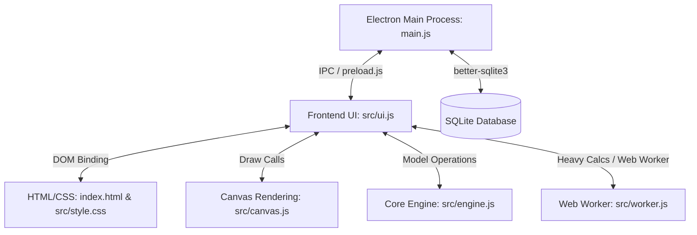

# Agent Behavioral Rules

## 🔍 Mandatory Rule & Skill File Consulting
- **Consult Markdown Rules Every Turn**: At the start of every turn, the agent MUST consult the behavioral rules in `.agents/AGENTS.md` and any relevant `.agents/skills/**/*.md` files. You must explicitly reference or confirm that you have reviewed these guidelines to maintain context and constraint compliance.
- **Instant Error Recovery & Proactive Verification**: If any error or warning is encountered during development or in a build/run check, the agent must instantly diagnose, fix, and rerun validation steps (like `npm run build`) without waiting for user instruction.

## 🤖 Interaction & Development Workflows (Antigravity Slash Commands)
Future agents working on this project must know and utilize the following Antigravity slash commands based on their specific triggers:

*   **`/grill-me` (Interactive Plan Critique)**:
    *   *Trigger*: Before writing or editing any code or file architectures.
    *   *Behavior*: You must automatically run this routine on your implementation plan to critique and refine the design logic through an interactive dialogue.
    *   *Implementation Guideline*: Present the proposed implementation plan to the user in a structured format, then prompt them with critical, high-value questions about potential edge cases, UX scaling (for 1000+ members), database integrity, or theme conflicts, ensuring design flaws are caught early.
*   **`/fix-errors` (Instant Error Recovery)**:
    *   *Trigger*: If any project build fails or if errors are detected in terminal outputs.
    *   *Behavior*: Instantly invoke this command to debug and correct runtime/compile issues without waiting for user prompting.
    *   *Implementation Guideline*: Automatically extract compile errors (Vite bundler failures, SQLite rebuild failures, Electron native bridge crashes), locate the failing lines, write a targeted recovery patch, and run verification builds immediately until clean execution is achieved.
*   **`/btw` (Milestone Summary Offloading)**:
    *   *Trigger*: When finalizing a milestone or summarizing architectural adjustments.
    *   *Behavior*: Compile and push the final summary results through an internal subagent task to keep the main workspace chat clean.
    *   *Implementation Guideline*: Collect list of modified files, completed checklists, and verification logs. Spawn an internal subagent to package this summary into the repository docs/logs directory, offloading the main context window while presenting a clean, high-level summary to the user.
*   **`/goal` (Long-Running Task Execution)**:
    *   *Trigger*: When the user requests a complex, multi-step task or overnight execution (e.g. major feature refactoring, system migration).
    *   *Behavior*: Recommend triggering `/goal` so that the agent remains thorough, resolves edge cases, and does not stop executing until the goal is fully met.
    *   *Implementation Guideline*: Structure the task into multiple discrete sub-tasks, maintain a persistent checklist in `task.md`, verify database integrity and regression safety at every stage, and run continuously in background mode without timing out.
*   **`/schedule` (Timer & Cron Scheduling)**:
    *   *Trigger*: When the user wants to set one-shot timers or run tasks on a recurring schedule.
    *   *Behavior*: Recommend this command to schedule automated builds, sanity checks, or periodic background tasks.
    *   *Implementation Guideline*: Configure automated cron sequences or duration-based timer schedules to run integration tests, check for native SQLite compatibility, or execute automated backups.
*   **`/browser` (Interactive Web Crawling)**:
    *   *Trigger*: When the agent needs to browse complex javascript-heavy web pages, search the web, or debug live web applications.
    *   *Behavior*: Suggest calling `/browser` to open an interactive session for research or integration tasks.
    *   *Implementation Guideline*: Launch an interactive, headful or scriptable browser context to retrieve documentation, research API endpoints, crawl javascript-rendered pages, and securely download third-party library assets.
*   **`/teamwork-preview` (Multi-Agent Collaboration)**:
    *   *Trigger*: For complex features that spans multiple modules (e.g. database schema migrations + UI adjustments + canvas optimizations).
    *   *Behavior*: Recommend the `/teamwork-preview` command to spin up a team of specialized subagents working concurrently.
    *   *Implementation Guideline*: Define clear boundaries and responsibilities for each subagent (e.g., database architect, frontend layout engineer, canvas performance engineer), orchestrate their concurrent tasks, and merge their contributions cleanly.

## 🧱 Development & Code Quality Rules
- **No Style Hardcoding**: Do not write hardcoded color hex values or ad-hoc margins. Always utilize the design system CSS custom properties from `src/style.css` so that visual themes (Light, Dark, Aero, PS1) render correctly.
- **Maintain Documentation Integrity**: Keep all existing comments, docstrings, and structure intact unless they are directly relevant to your changes.
- **Translation Safety**: Wrap technical identifiers (such as record IDs like `alan`, database primary keys, or file paths) in class `no-translate` to prevent Google Translate from corrupting system models.
- **Canvas RTL Restrictions**: Force LTR node coordinate computation (`isAr = false`) on canvas layouts to prevent text offsets and connection bracket clippings in Arabic, while translating the text values using the `t()` helper.
- **Web Worker Delegation**: Offload heavy graph traversals, searches, or rendering computations that take >50ms to the Web Worker (`src/worker.js`) to keep the UI frame rate high.
- **Parameterize All SQL Queries**: Do not use dynamic string concatenation or template literals for SQL variables (e.g. `SELECT * FROM people WHERE id = '${id}'`). Use parameterized SQL bindings (e.g., `db.prepare('...').get(id)`) to prevent syntax failures from names with single quotes/apostrophes and to secure the database against injection vectors.
- **XSS and HTML Injection Prevention**: Prevent rendering raw string values directly into element `innerHTML` fields when displaying database content (like first/last names, notes, or birthplaces). Use `textContent`, `innerText`, or secure text node assignment to prevent executing injected scripts or breaking the DOM element properties.
- **Prevent Mojibake & Force UTF-8**: Explicitly define character encoding (UTF-8) on all file system reads/writes and translation dictionary operations.
- **Canvas Spatial & Paint Loop Optimization**: For tables with 1000+ members, optimize canvas drawing by using bounding-box viewport intersection (frustum culling) to skip drawing nodes outside the visible canvas region. Cache text measurement widths (`ctx.measureText`) inside layout objects to prevent measuring text repeatedly on every frame.
- **Vite Static Asset Handling**: Dynamically loaded external packages (such as `jsPDF`) must be placed inside the `public/` directory so that Vite bundles them correctly at the compilation root, ensuring that runtime relative path loads (e.g. `./jspdf.umd.min.js`) resolve correctly in Electron builds.
- **Backwards-Compatible Schema Migrations**: Implement database changes via defensive column and table validation. Wrap schema alters inside transactions and `try-catch` blocks, using `IF NOT EXISTS` conditions to preserve existing records. Do not drop database assets programmatically without providing automatic backup recovery procedures.
- **Avoid Multi-Canvas Event Conflicts**: Global keyboard or window-bound listeners (such as keydowns) instantiated across multiple canvases (e.g., Lineage Canvas and World Canvas) must verify if their corresponding tab view container is active and visible (e.g. checking that the parent tab panel `#tab-explorer` or `#tab-world` is not hidden) before executing modifications, preventing simultaneous offscreen panning/zooming.
- **Theme Variable Caching**: Canvas renderers must cache computed CSS custom properties inside a local variable (e.g., `this.themeColors`) and only re-query them when the active theme class on `document.body` changes. Querying `getComputedStyle()` inside the 60 FPS animation/draw loop causes layout thrashing and drops frames.
- **Consistent App Versions**: Ensure that version indicators in `package.json`, the titlebar build badge, sidebar system info, tutorial accordion blocks, and the About section card are bumped synchronously to prevent version mismatches.
- **Build Verification**: Proactively run `npm run build` after editing code to verify that Vite bundles everything without errors.
- **Relative Path Bindings**: Always use relative paths (`./`) for assets in Vite/Electron configuration to ensure index.html links resolve correctly under the `file://` protocol.
- **GitHub Push Restriction**: Never proactively suggest, ask, or prompt the user to push to GitHub. The push workflow must only trigger when the user explicitly commands it. When requested, alert the user first and wait for their explicit final confirmation before executing git push.
- **Windows GUI Sandbox Session Limits**: When requested to run or test the GUI application (such as `npm run electron:start`), launching it from the agent sandbox terminal runs it inside a background/headless session which will not render visually on the user's active screen. Verify the build first, try to launch it to check for start crashes, and then instruct the user to run `npm run electron:start` manually in their local host shell if it doesn't appear.

---

# Repository Architecture & Guidelines (Extra C Family Tree Explorer)

Welcome to the Extra C Family Tree Explorer development repository. This document outlines the architectural patterns, modules, data flows, and best practices to guide agents when maintaining or scaling this codebase.

## 🏗️ 1. Core Architecture & Modules

The application is built on Electron (v31.x) with a Vite-powered HTML5 Canvas and vanilla ES modules frontend. 



### 🔹 Main Process (`main.js`)
- **Responsibilities**: Creates the transparent splash screen window (`splashWindow`), creates the main frameless window (`mainWindow`), registers global IPC handlers for SQLite operations, handles Google Translate API translations, and manages window controls (minimize/maximize/close).
- **Guidelines**: Keep database operations synchronous within transaction blocks on the SQLite thread to avoid race conditions. Run dynamic assets check or downloads under separate streams or promises to avoid locking the Electron event loop.

### 🔹 Preload Script (`preload.js`)
- **Responsibilities**: Exposes secure API bridges (`ipcRenderer.invoke`, `ipcRenderer.on`) to the renderer process.
- **Guidelines**: Do not expose raw `require` or native node components to the renderer context. Maintain strict context isolation.

### 🔹 Core Engine (`src/engine.js`)
- **Responsibilities**: Manages the in-memory family tree graph, handles searches, performs relationship calculations (parents, spouses, siblings, ancestors, descendants), and loads/saves data.
- **Guidelines**: Keep the engine decoupled from DOM and rendering logic. It should operate purely on JavaScript data models.

### 🔹 Canvas Renderer (`src/canvas.js`)
- **Responsibilities**: Draws the lineage tree, ancestor/descendant cards, sibling lines, and spouse brackets using HTML5 Canvas APIs. Supports different visual themes.
- **Guidelines**:
  - Keep redrawing optimized. Cache dimensions and bounding boxes.
  - Implement rendering branches for standard themes versus customized themes (e.g. monospaced fonts and PlayStation shapes under PS1 mode).
  - Mirroring layout on RTL languages is disabled (canvas LTR mode is forced) to avoid name overflow and connection bracket clipping. Keep names left-aligned/centered on standard canvas cards regardless of locale.

### 🔹 Frontend UI Controller (`src/ui.js`)
- **Responsibilities**: Handles user interactions, binds DOM events, manages settings/tabs navigation state, triggers popups/dialogs, initiates language walks, and dispatches tasks to the worker thread.
- **Guidelines**:
  - Keep active navigation state saved in `localStorage` to preserve tabs during reloads.
  - Apply transition effects during locale swaps to allow clean, responsive rendering.

### 🔹 Web Worker (`src/worker.js`)
- **Responsibilities**: Handles heavy graph calculations, search indexing, and translations in a background thread to prevent UI freezing for large family datasets (1000+ members).
- **Guidelines**: Any task taking >50ms should be offloaded to this worker. Communicates with `src/ui.js` via `postMessage`.

---

## 💾 2. Data Persistence & IPC Communication

- **Database**: SQLite database stored in the user's application data directory (`family_tree.db`).
- **Tables**:
  - `people`: `id (TEXT PRIMARY KEY)`, `firstName (TEXT)`, `familyName (TEXT)`, `gender (TEXT)`, `photo (TEXT)`, `notes (TEXT)`
  - `relationships`: `id (TEXT PRIMARY KEY)`, `person1Id (TEXT)`, `person2Id (TEXT)`, `type (TEXT)`, `metadata (TEXT)`
- **IPC Invocation**: Always use asynchronous IPC handlers in the renderer:
  ```javascript
  const result = await window.electron.ipcRenderer.invoke('db-get', sql, params);
  ```
- **Local Settings**: Store visual settings (`family-tree-theme`, `app-language`, `sidebar-auto-hide`, etc.) in `localStorage`. They must be checked early during startup (e.g., in `splash.html` and `index.html`) to prevent theme/layout flashes.

---

## 🎨 3. Theme & Styling Guidelines

The application supports four primary themes: Light, Dark, Windows 7 Aero, and PlayStation 1 Retro.

- **Design System Tokens**: Use CSS variables located in `src/style.css` for styling. Do not write hardcoded color hexes or margins.
- **Theme Classes**: Applied directly to the `body` element (`.theme-dark`, `.theme-win7`, `.theme-ps1`).
- **Windows 7 Aero Theme Rules**:
  - Relies on glassmorphic backgrounds (`backdrop-filter: blur(20px)`) and translucent borders (`rgba(255, 255, 255, 0.6)`).
  - Incorporates glowing drop shadows and Segoe UI fonts.
- **PlayStation 1 Theme Rules**:
  - Replaces traditional shapes and colors with monochrome grey bevel cards, scanlines overlays (`::after`), screen flicker animations, and monospaced typography.
  - Renders vector controller buttons on canvas cards: Male = Green Triangle (🔺), Female = Pink Square (⏹️), Focus = Red Circle (🔴), Deceased = Blue Cross (❌).
- **Splash Screen Support**: Ensure any modifications to `splash.html` honor the floating rounded card aesthetics with full translucent body styling.

---

## 🌐 4. Internationalization & Locale Rules

- **Bilingual Interface**: Seamlessly translates between English (`en`) and Arabic (`ar`).
- **Translation Protection**: When walking the DOM during translation runs, elements tagged with `class="no-translate"` (e.g. data entity IDs like `alan`, database primary keys, system paths) **must be skipped** to prevent data model corruption.
- **Text Alignment**: Ensure layout properties (`dir="ltr"` or `dir="rtl"`) are applied to the document body to correctly mirror sidebars, form inputs, and typography flow.

---

## 📦 5. Packaging & Building

- **Vite Bundler**: Run `npm run build` to compile assets into `dist/`. Base paths must be relative `./` to work in Electron file loaders.
- **Electron Builder**: Run `npm run build:exe` to pack the binary. Native dependencies (such as `better-sqlite3`) are rebuilt using prebuilt binaries target-matched to Electron version `31.7.7` on Windows x64.
- **Bilingual Setup**: The installer is a multi-language setup (Arabic/English). Custom assets reside in the `build/` directory (`icon.png`, `installerSidebar.png`, `installerHeader.png`).

---

## 🛠️ 6. Feature Implementation & Maintenance Guidelines

To keep the application highly maintainable, modular, and performant:

### 🔹 Schema Migration & Backward Compatibility
- When adding columns or modifying tables, always write defensive queries inside `main.js` wrapped in `try-catch` blocks (e.g., `ALTER TABLE people ADD COLUMN ...`).
- Never run destructive queries (`DROP TABLE`) without explicit user-backed backup logic.

### 🔹 Canvas Paint Loop Optimization
- The paint loop inside `canvas.js` (specifically `drawNodes` and `drawConnections`) runs at 60 FPS during drag/zoom actions.
- **Do not** instantiate new objects, perform database lookups, query translated strings, or execute regex matches within the draw cycle. Pre-calculate layout structures and cache key positions inside the layout data models beforehand.

### 🔹 Content Security Policy (CSP) & Script Loading
- The application enforces a strict Content Security Policy.
- Never inject external `<script>` elements linking to external domains directly in the HTML.
- For modules requiring dynamic libraries (such as `jsPDF` for tree export), register secure IPC downloading paths (`download-jspdf`) in the main process to verify, download, caching, and serving scripts locally.

### 🔹 Onboarding & Interactive Tours
- Ensure that any major layout additions, new controls, or advanced tab modules are documented and mapped within the interactive driver steps in `src/tour.js` so that new users are guided seamlessly.

---

## 🧬 7. Integrated Scientific Skills & Plugins (Antigravity Science Stack)

For features linking the Family Tree with biological ancestry, clinical history, or medical research data, agents have access to the following integrated Antigravity 2 plugins. Refer to these commands/skills when querying external databases:

### 🔹 Chemical & Drug Databases
- **`/chembl-database`**: Use to search for bioactive molecules, drug targets, approved medications, bioactivities (IC50, Ki), and chemical structures.
- **`/pubchem-database`**: Use to lookup chemical properties, structures, CIDs, and safety data.
- **`/openfda-database`**: Use to search FDA adverse events, recalls, labeling, NDC codes, and drug shortages.

### 🔹 Proteomics & Protein Structures
- **`/uniprot-database`**: Use to retrieve protein sequence metadata, functional annotations, taxonomy, and gene-to-protein mapping.
- **`/pdb-database`**: Use to download experimentally-determined 3D biomolecular structures (PDB, CIF).
- **`/alphafold-database-fetch-and-analyze`**: Use to retrieve and analyze AlphaFold structural confidence metrics (pLDDT) and disorder assessments.
- **`/pymol`**: Use to perform 3D structural alignments and render visual molecular structures.
- **`/foldseek-structural-search`**: Use to find structural homologs using a physical 3D coordinate file.

### 🔹 Genomics & Variant Analysis
- **`/ensembl-database`**: Primary tool to map gene IDs, fetch nucleotide/protein sequences, and predict variant consequences.
- **`/dbsnp-database`**: Use to map genetic variants (SNPs, indels) using rsIDs, VCF coordinates, or HGVS strings.
- **`/clinvar-database`**: Use to query clinical significance and pathogenicity classifications of genetic variants.
- **`/gnomad-database`**: Use to fetch allele frequencies, constraint metrics (pLI), and assess variant tolerance in populations.

### 🔹 Gene Expression & Regulation
- **`/gtex-database`**: Use to search quantitative RNA expression data and eQTLs across non-diseased tissue sites.
- **`/human-protein-atlas-database`**: Use to check spatial protein expression and cellular localization.
- **`/encode-ccres-database`**: Use to locate cis-Regulatory elements (cCREs) and epigenomic regions.
- **`/jaspar-database`**: Use to retrieve transcription factor binding profiles (PFMs/PWMs).

### 🔹 Literature & Research Search
- **`/pubmed-database`**: Search biomedical papers, PMIDs, and link literature with biological database entities.
- **`/literature-search-openalex`**: Retrieve citations, DOIs, impact metrics, and compile author bibliographies.
- **`/literature-search-arxiv`**: Search and retrieve preprints and scientific papers.

---

## 🎛️ 8. Surname Registry & Dynastic Health Scanner Guidelines

### 🔹 Surname Registry & Family Index
- **Dynamic Compilation**: Surnames lists and frequencies must be computed dynamically using `this.engine.getAllPeople()` rather than reading from static lists to ensure newly added or modified family names are synchronized instantly.
- **Visual Grid Routing**: Matching members must be rendered inside the details grid view (`#surname-members-list`) with direct focus actions. Triggering `🎯 View in Explorer` must set the canvas focus coordinates and transition the active tab view panel to the Tree Explorer (`#tab-explorer`).

### 🔹 Dynastic Health & Conflict Scanner
- **Web Worker Delegation**: All database-wide chronological audits (impossible lifespans, age inversions, extreme parent age gaps) must be performed inside `src/worker.js` by calling `auditDynasticHealth` to prevent rendering frame drops on large graphs.
- **UI Progress Flow**: Validation scans must execute a 12-second charging interval, updating progress counters and logs (0-20% Birth Chronicles, 20-50% Lifespan audits, 50-80% Generation Gaps, 80-100% Compilation) to mimic quantum database alignment computations.
- **Quick-Fix Shortcuts**: All detected conflicts must list direct action links mapping to `this.showEditModal(personId)` so that operators can immediately correct chronal inversions or lifespan anomalies inside the edit form overlay.